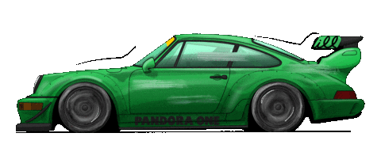
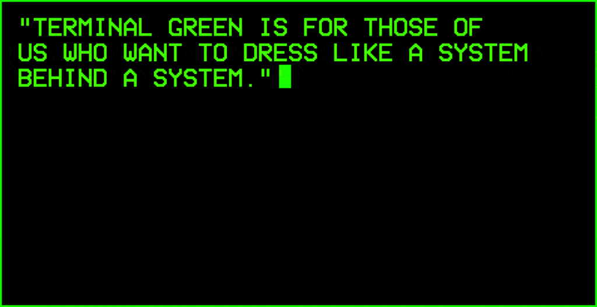

  

<h1 align="center">Hi there 👋, I'm Sodiq</h1>

  

 

---

  
  
  
  
  

 

### 🤖 About Me

- 🔭 I'm currently studying at **21-school**
- 🌱 I'm learning **Docker, Prometheus, Grafana & all things DevOps**
- 🔄 I dual-boot reality with **Windows 11 + Arch Linux**
- 🎮 When I'm not coding, I'm probably fragging on **CS 2** or building in **Minecraft**
-  I talk to **Linux terminals** more than I talk to people (and they actually listen!)
- ☕ Coffee level: `systemctl status --all OK`

 

---

### 💻 Tech Stack

🌐 **OS**: Arch • Ubuntu • Windows 11  
⚙️ **Tools**: Docker • Git • CI/CD • Bash  
🔧 **Infra**: Prometheus • Grafana • Nginx • Samba  
🧠 **Learning**: QA • YAML Wizardry • Docker • Kubernetes  
🐱‍💻 **Editor**: VS Code (with 10+ extensions I don't remember installing)

 

---

### 🧙 Terminal Magic

> `devopsctl init --with-coffee --verbose`

- [x] Create virtual labs on VirtualBox  
- [x] Master SSH, CRON, systemctl, logging  
- [x] Make Grafana dashboards cooler than dark mode  
- [ ] Sleep regularly  
- [ ] Finish learning Kubernetes without rage quitting

 

---

  

### 📊 GitHub Stats

  
  

 

---

  

 

---

### 🛠️ My Dev Toolbox

  
  
  
  
  
  
  
  
  
  
  
  
  
  

 

---

### ⚡ Fun Facts

- 🐱 Cats make better debugging partners than humans  
- ☕ I believe every good script starts with `#!/bin/bash` and a sip of espresso  
- 📸 Pinterest board = my visual brain  
- 🚗 Dream ride? **Porsche 911 GT3 RS**

  

 

---

### 📬 Let's Connect

  
  
  
  
  

 

---

  
> 🧘‍♂️ _"Keep calm and `chmod +x` your dreams."_

 

---

  Built with ❤️ and ☕ by Sodiq

